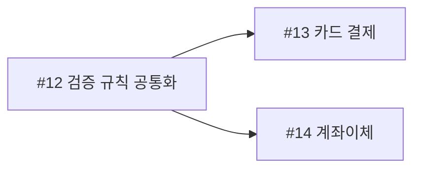

# Project Starter Kit

새 프로젝트를 만들 때 필요한 파일을 골라 복사하는 범용 협업 템플릿 모음입니다. 특정 언어·프레임워크·라벨 체계에 종속되지 않습니다.

템플릿 원본은 모두 `templates/common/`에 보관합니다. 이 저장소 루트에는 적용용 `AGENTS.md`, `CLAUDE.md`, `.github/`를 두지 않습니다.

## 구성

| 템플릿 | 용도 |
| --- | --- |
| [AGENTS.md](templates/common/AGENTS.md) | 작업·검증·Git·이슈·PR 작성 공통 지침 |
| [CLAUDE.md](templates/common/CLAUDE.md) | @AGENTS.md로 공통 지침 가져오기와 Claude 전용 지침 확장 위치 |
| [결함 보고](templates/common/.github/ISSUE_TEMPLATE/bug.yml) | 현재·기대 동작, 재현 방법, 환경, 선택 흐름도 |
| [기능·개선 제안](templates/common/.github/ISSUE_TEMPLATE/change.yml) | 현재·목표 상태, 제안 방법과 범위, 완료 조건, 선택 흐름도 |
| [부모 이슈](templates/common/.github/ISSUE_TEMPLATE/parent.yml) | 여러 자식 이슈로 나누는 큰 작업의 범위·진행 순서·공통 완료 조건 |
| [질문·사용 문의](templates/common/.github/ISSUE_TEMPLATE/question.yml) | 사용 상황과 확인한 자료 |
| [이슈 선택 설정](templates/common/.github/ISSUE_TEMPLATE/config.yml) | 빈 이슈 대신 양식 선택, 외부 문의 경로 예시 |
| [PR 템플릿](templates/common/.github/pull_request_template.md) | 요약, 변경, 완료 조건, 검증, 영향과 남은 문제 |

## 가져다 쓰는 방법

1. 이 저장소를 내려받습니다.
2. `templates/common/` 안의 필요한 파일·폴더를 **대상 프로젝트 루트**에 복사합니다. `templates/common` 폴더 자체를 복사하는 것이 아닙니다.
3. 기존 `AGENTS.md`, `CLAUDE.md`, `.github/`가 있다면 덮어쓰지 말고 필요한 내용만 병합합니다.
4. 프로젝트의 설치·실행·검사 명령과 구조를 `AGENTS.md`에 추가하거나 기존 README·기여 문서를 연결합니다.
5. 대상 프로젝트의 기본 브랜치에 반영한 뒤 새 이슈 선택 화면과 새 PR 본문을 확인합니다.

복사한 프로젝트의 구성 예시:

```text
my-project/
├── AGENTS.md
├── CLAUDE.md
└── .github/
    ├── ISSUE_TEMPLATE/
    │   ├── bug.yml
    │   ├── change.yml
    │   ├── parent.yml
    │   ├── question.yml
    │   └── config.yml
    └── pull_request_template.md
```

- 공통 규칙은 `AGENTS.md`에서 관리하고 `CLAUDE.md` 안의 `@AGENTS.md`로 가져옵니다. 두 파일을 함께 복사합니다.
- 이슈·PR 양식만 필요하면 `.github/`만 복사해도 됩니다.
- `.github`는 숨김 폴더일 수 있으므로 복사할 때 포함 여부를 확인합니다.
- 이 저장소를 복제하는 것만으로는 양식이 적용되지 않습니다. 사용할 파일을 대상 프로젝트의 위 경로에 배치해야 합니다.
- 복사본은 자동 동기화되지 않습니다. 원본 업데이트 시 diff를 비교해 프로젝트별 수정을 보존하면서 필요한 변경만 반영합니다.

## 작성 원칙

- 이슈·PR 최상단에 짧은 요약 불릿 2~3개 배치
- 한 줄에 한 가지 핵심, 명사형·단답형 종결
- 요약에서 `~합니다`, `~습니다`, `~입니다`, `~한다` 등 서술형 종결 생략
- 결함 제목은 대상과 증상, 개선 제목은 원하는 변경, PR 제목은 실제 변경 결과 표현
- 이슈는 현재 상태(AS-IS)와 목표 상태(TO-BE)를 구분하고 완료 조건에는 확인할 결과 기재
- 구현 상세·긴 경로·로그는 하단 본문에 기재
- 목록 안의 `#번호`는 GitHub가 이슈 제목·상태로 펼쳐 한 줄이 길어지므로, 목록 한 줄에는 번호 하나만 쓰고 여러 번호·관계는 표나 문장으로 작성
- 흐름·의존 관계가 복잡할 때만 Mermaid 흐름도 추가, 짧은 흐름은 `A → B → C` 한 줄로 충분
- UI·CLI·API 작성에 동일한 원칙 적용

| 구분 | 제목 예시 |
| --- | --- |
| 결함 | 설정 저장 후 언어 선택 초기화 |
| 개선 | 검색 결과 정렬 옵션 추가 |
| 부모 | [부모] 결제 흐름 개편 |
| 질문 | 프로젝트별 설정의 적용 우선순위 문의 |
| PR | fix: 저장한 언어 설정 유지 |

PR 요약 예시:

```markdown
## 요약

- 저장한 언어 설정의 재접속 시 복원
- 설정 누락 시 기본 언어 적용
```

## 부모 이슈와 자식 작업

여러 PR로 나누는 큰 작업은 부모 이슈 양식으로 범위와 진행 순서를 관리합니다. 부모는 자체 구현 PR을 갖지 않고, 하나의 PR로 끝나는 작업에는 부모를 만들지 않습니다.

- 자식 이슈는 GitHub sub-issue로 연결하고, 먼저 끝나야 하는 자식은 blocked-by로 연결합니다. 본문의 자식 표는 읽기용 보조 기록입니다.
- 자식 지도는 표로 작성합니다. 같은 단계는 병렬로 진행하고, 담당 범위는 한 줄로 쓴 뒤 세부 내용은 자식 이슈에 둡니다.
- 선행 관계가 여러 갈래로 얽히면 `흐름도 (선택)` 칸에 Mermaid 코드를 넣습니다. 이슈 본문에서 도식으로 렌더링됩니다.

```markdown
| 단계 | 자식 | 담당 범위 | 선행 |
| :-: | --- | --- | --- |
| 1 | #12 | 결제 검증 규칙 공통화 | 없음 |
| 2 | #13 | 카드 결제 단계 적용 | #12 |
| 2 | #14 | 계좌이체 단계 적용 | #12 |

같은 단계는 병렬 진행.
```



## 프로젝트별 조정

- 기본 문안은 한국어입니다. 팀의 작성 언어에 맞게 수정할 수 있습니다.
- 라벨·담당자·우선순위는 자동 지정하지 않습니다. 필요하면 대상 저장소에 실제 존재하는 값으로 설정합니다.
- 자유 양식 이슈도 허용하려면 `config.yml`의 `blank_issues_enabled`를 `true`로 변경합니다.
- 질문을 Discussions 등으로 받는 프로젝트는 질문 폼을 제외하고 `config.yml`의 `contact_links` 예시로 해당 경로를 안내할 수 있습니다.
- 여러 PR로 나누는 큰 작업이 드문 프로젝트는 `parent.yml`을 빼도 됩니다. 부모 제목 접두어 `[부모]`는 팀 관례에 맞게 바꿀 수 있습니다.
- `흐름도 (선택)` 칸은 선택 항목입니다. 쓰지 않는 팀은 각 폼에서 해당 항목을 삭제해도 됩니다.
- PR 항목이 과하면 프로젝트에 맞게 줄이되, 요약·변경·검증은 유지하는 것을 권장합니다.
- 이슈 폼은 필수 입력 여부를 검사하며, 불릿 수와 문체를 자동 검증하지는 않습니다. PR 템플릿과 에이전트 지침도 별도 검사 도구를 포함하지 않습니다.

이 세트에는 특정 프로젝트의 배포 절차, 검사 명령, 라벨 정책, 강제 머지 규칙이나 CI 워크플로를 포함하지 않습니다.
